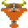

<!-- PROJECT LOGO -->
<br />
<div align="center">
  <a href="https://github.com/Moyaxzan/Jumping-Dwarf">
    
  </a>

  <h3 align="center">Jumping Dwarf</h3>

  <p align="center">
    The best indie game you will ever see !
    <br />
  </p>
</div>


<!-- TABLE OF CONTENTS -->
<details>
  <summary>Table of Contents</summary>
  <ol>
    <li>
      <a href="#about-the-project">About The Project</a>
    </li>
    <li>
      <a href="#getting-started">Getting Started</a>
      <ul>
        <li><a href="#prerequisites">Prerequisites</a></li>
        <li><a href="#installation">Installation</a></li>
      </ul>
    </li>
    <li><a href="#usage">Usage</a></li>
    <li><a href="#acknowledgments">Acknowledgments</a></li>
  </ol>
</details>


## About The Project

We are 6 L1 students from EFREI Paris - School of Generalist Digital Engineering.

We had to do a game for our 2nd semester that has to contain a trajectory formula.

We decided to create Jumping Dwarf because we have been inspired by the Game [Jump King](https://store.steampowered.com/app/1061090/Jump_King/).

Some of us were really motivated about it, and that is what allowed us to have a complete game that we like containing music, nice visuals and good feelings when playing. Because we believe that if we enjoy playing the game, others will.

We hope you will enjoy playing the game as much as we do !
<p align="right">(<a href="#top">back to top</a>)</p>


## Getting Started

### Prerequisites

* python <br>
Download Python 3.7 or earlier versions at https://www.python.org/downloads/
* pygame
 ```sh
 python3 -m pip install -U pygame --user
 ```
 see [Pygame: Getting Started](https://www.pygame.org/wiki/GettingStarted)
 
 
### Installation

Clone the repo
```sh
git clone https://github.com/your_username_/Project-Name.git
```


<p align="right">(<a href="#top">back to top</a>)</p>


## Usage

In order to play the game you will need a keyboard since you need to hold the spacebar to jump. The longer you hold it, the higher you jump. In order to perform the jump you simply need to release the spacebar, or it will do it automatically if you cannot jump any higher.

Be careful ! You have no air-control.

Which means that you cannot move your character while you are not on the ground. Once you jumped, you can only wish you succeded and look at the result.

In order to jump to the left you will need to hold the "Q" key while releasing you jump. Same process for the right side but this time you will need to press the "D" key.

<p align="right">(<a href="#top">back to top</a>)</p>


## Acknowledgments

* [pygame](https://www.pygame.org/docs/)
* [Trello](https://trello.com/)

<p align="right">(<a href="#top">back to top</a>)</p>
